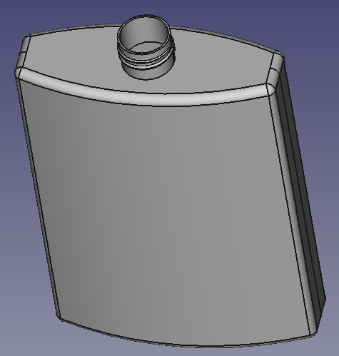

# OCCT Tutorial - Bottle
Here there is the bottle tutorial that appears in the official documentation:
- [OCCT - botte tutorial](https://old.opencascade.com/doc/occt-7.5.0/overview/html/occt__tutorial.html)

[3d model viewer](https://3dviewer.net/embed.html#model=https://raw.githubusercontent.com/mantielero/occt.nim/main/examples/tutorials/occt_tutorial/bottle.stp$camera=-8.39009,-87.10222,124.60955,0.00000,0.00000,38.50000,0.00000,1.00000,0.00000,45.00000$cameramode=perspective$envsettings=fishermans_bastion,off$backgroundcolor=255,255,255,255$defaultcolor=200,200,200$edgesettings=off,0,0,0,1)
